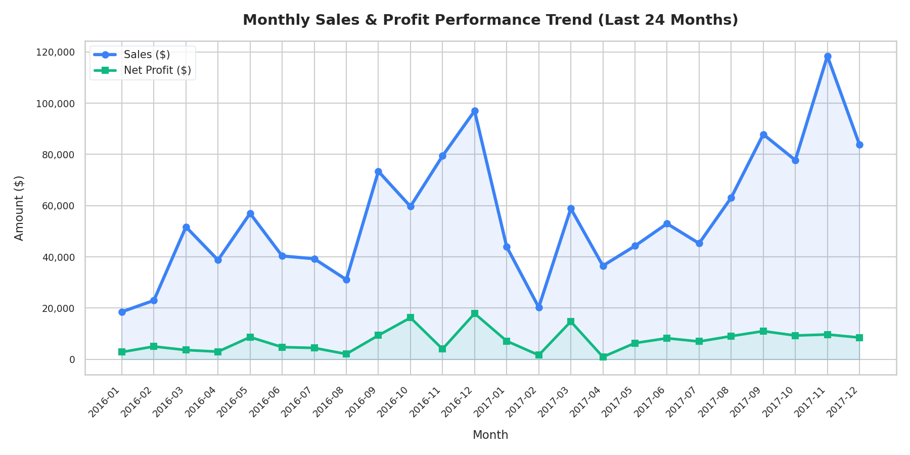
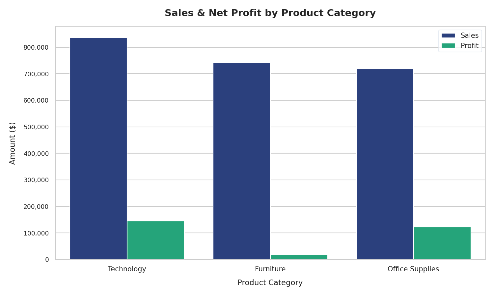
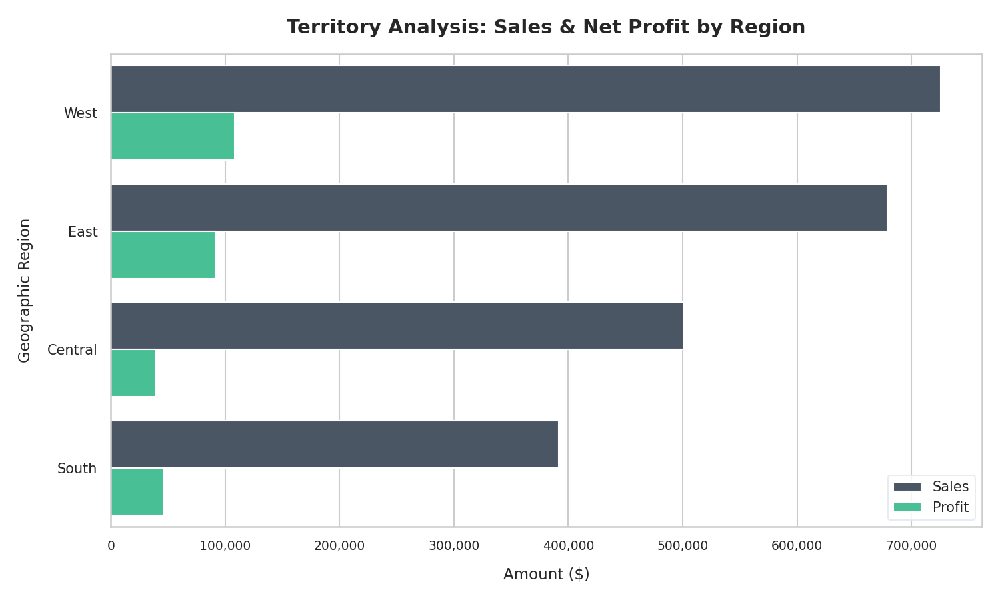

# Superstore Retail Sales & Profitability Analysis Portfolio Project

[](./sql/)
[](./excel/)
[](./power_bi/)
[](./scripts/)

Welcome! This repository houses a comprehensive, end-to-end data analysis project targeting retail operations using the classic **Superstore Sales Dataset**. 

This portfolio project highlights key competencies in **SQL (advanced querying)**, **Excel (interactive dashboard creation)**, **Power BI (dimensional modeling & DAX)**, and **Python (ETL automation)**.

---

## 📌 Business Overview & Problem Statement
The Superstore is a major retail chain facing challenges in optimizing its profit margins across different product lines, regions, and customer segments. Despite achieving high sales volume (~$2.3M), the company needs to identify:
1. **Profit Leaks**: Which products and categories are losing money?
2. **Seasonality and Growth**: What do the monthly sales and profit trends reveal?
3. **Customer Value**: Who are the high-value customers, and who is at risk of churning?

This project delivers data-driven solutions to these questions to support executive decision-making.

---

## 📁 Repository Structure
```text
├── data/
│   ├── raw/               # Original, unprocessed dataset (CSV)
│   └── processed/         # Cleaned CSV & local SQLite Database (superstore.db)
├── sql/
│   ├── schema.sql         # SQL schema definitions
│   ├── monthly_sales_profit.sql  # Seasonality & running totals
│   ├── product_performance.sql   # Ranking top/bottom items using window functions
│   └── customer_segmentation.sql  # Customer RFM categories using CTEs
├── excel/
│   └── Superstore_Sales_Dashboard.xlsx # Formatted dashboard with KPIs, Pivot tables, & Slicers
├── power_bi/
│   └── guide.md           # Guide on Star Schema modeling, relationships, and advanced DAX
├── scripts/
│   ├── download_data.py   # Script to fetch raw dataset
│   ├── etl_process.py     # Python script for cleaning and loading to SQLite/JSON
│   └── generate_plots.py  # Script generating visual charts for the repository
└── README.md              # Project documentation
```

---

## 📈 Visual Dashboard Showcase

These charts represent the visual insights built into the **Excel Dashboard** and outlined in the **Power BI Guide**:

### 1. Monthly Performance Trends (Sales vs. Profit)
*Understanding seasonality and growth spikes:*


### 2. Category Breakdown
*Identifying product categories driving the highest volume and profit:*


### 3. Territorial Analysis
*Locating geographic regions with the strongest contribution:*


---

## 💻 Technical Walkthrough

### 1. Data Prep (ETL Phase with Python)
The raw dataset was processed using [etl_process.py](./scripts/etl_process.py) to:
- Standardize mixed date formats (`MM-DD-YYYY`, `M/D/YYYY`) to YYYY-MM-DD for database compliance.
- Cast numeric values into proper decimal and integer formats.
- Load clean transactions into a relational SQLite Database (`superstore.db`).
- Export a clean UTF-8 CSV (`superstore_clean.csv`) for seamless import into Power BI/Excel.

### 2. Advanced Database Analysis (SQL)
The [sql/](./sql/) folder contains queries written to extract deep commercial insights:
* **Monthly Trends & Running Totals**: Using window functions to calculate cumulative revenue over time ([monthly_sales_profit.sql](./sql/monthly_sales_profit.sql)).
* **Product Ranks by Profitability**: Using `DENSE_RANK() OVER (PARTITION BY category ORDER BY profit ...)` to filter the top 5 profit makers and top 5 money-losing products ([product_performance.sql](./sql/product_performance.sql)).
* **Customer RFM Segmentation**: Leveraging Common Table Expressions (CTEs) and `julianday()` calculations to segment customers by order recency and frequency ([customer_segmentation.sql](./sql/customer_segmentation.sql)).

### 3. Excel Executive Dashboard
The [excel/](./excel/) folder contains a programmatically generated, fully-styled workbook:
- **`Executive Dashboard` Tab**: Features custom KPI blocks, a 24-month trendline chart, category column charts, and regional horizontal bar charts. Gridlines are hidden for a modern application-like appearance.
- **`Dashboard_Calculations` Tab**: Hosts organized pivot-equivalent summary tables feeding the charts.
- **`Clean Orders Dataset` Tab**: Features the full clean table formatted with clean header styles, currency columns (`$#,##0.00`), and percentage cells.

### 4. Power BI Implementation Guide
The [power_bi/](./power_bi/) directory contains a complete [design guide](./power_bi/guide.md) detailing:
- **Dimensional Modeling**: Migrating the flat table to a Star Schema model linking fact tables (`Fact_Orders`) to dimensions (`Dim_Customers`, `Dim_Products`, `Dim_Geography`, `Dim_Calendar`).
- **DAX Formulas**: Including measures for `Total Sales`, `Total Profit`, `Profit Margin`, and advanced Time Intelligence formulas like Year-To-Date (`YTD Sales`) and Year-over-Year Growth (`YoY Sales Growth %`).

---

## 💡 Key Actionable Business Insights
1. **Technology Leads in Profits**: While Technology and Furniture have comparable sales volumes, Technology generates more than double the profit of Office Supplies and Furniture combined. **Recommendation**: Allocate more marketing budget to high-margin Tech products.
2. **Furniture Margin Crisis**: Furniture brings in high revenue but suffers from extremely low margins (~2.8%). Sub-categories like *Tables* and *Bookcases* are heavily loss-making due to high freight costs or excessive discounting. **Recommendation**: Audit pricing strategies and reduce discounts on these items.
3. **Territory Leaders**: The East and West regions account for over 65% of net profits. The Central region underperforms significantly. **Recommendation**: Optimize supply chains and distribution networks in the Central region to cut down operational overhead.

---

## 🚀 How to Run the Project Locally
1. Clone this repository:
   ```bash
   git clone https://github.com/AhmedSaidRR/superstore-sales-analysis.git
   cd superstore-sales-analysis
   ```
2. Set up dependencies:
   ```bash
   pip install pandas matplotlib seaborn xlsxwriter openpyxl
   ```
3. Run the ETL pipeline to generate the database and CSV:
   ```bash
   python scripts/etl_process.py
   ```
4. Generate the Excel Dashboard:
   ```bash
   python scripts/generate_excel_dashboard.py
   ```
5. View the SQL analysis results by querying the SQLite database or opening the [sql/](./sql/) files.
